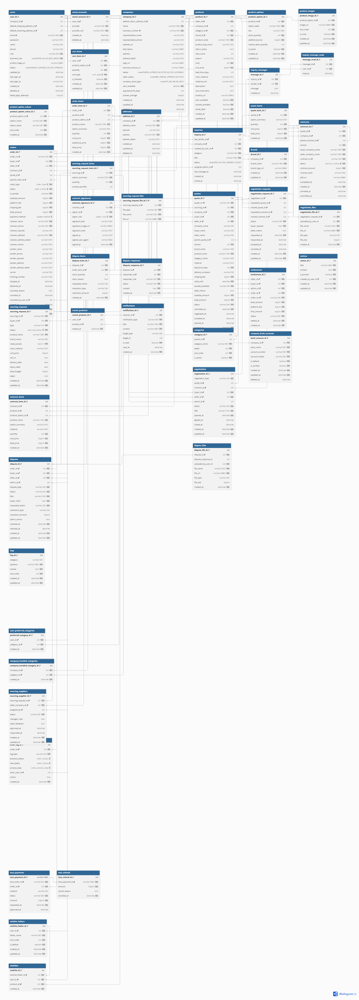

# Database

국내 여성의류 B2B 플랫폼의 데이터베이스 설계 문서입니다.
상품 등록과 일반 구매뿐 아니라 샘플 주문, 소싱 요청, 견적 협의 등 B2B 거래 과정을 관리할 수 있도록 설계했습니다.

## ERD



- [DBML 원본](./schema.dbml)
- DB 구조를 변경할 때 `schema.dbml`과 `erd.png`를 함께 갱신합니다.

## 주요 거래 흐름

```text
일반 구매: 상품 조회 -> 장바구니 -> 주문 -> 결제 -> 배송 -> 거래 확정
소싱 구매: 소싱 요청 -> 견적 작성 및 협의 -> 견적 채택 -> 주문
```